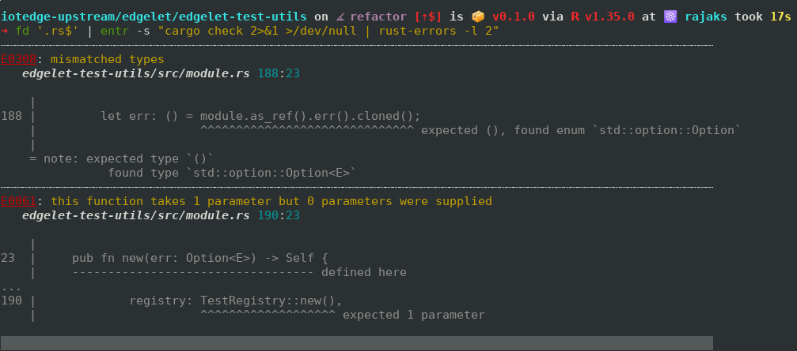

# rust-errors

Parse Rust compiler errors and print top N errors to console. Useful when you
don't want to see a wall of errors scrolling away in your terminal and want to
just fix the top N errors one by one. Enables a workflow such as the following:

```bash
fd '.rs$' | entr -s "cargo check 2>&1 >/dev/null | rust-errors -l 2"
```

Where [fd](https://crates.io/crates/fd-find) is a fast file finder replacement
for [find](http://man7.org/linux/man-pages/man1/find.1.html) and [entr](http://eradman.com/entrproject/)
is a general purpose file watcher. The output looks like this:

